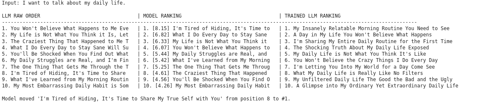
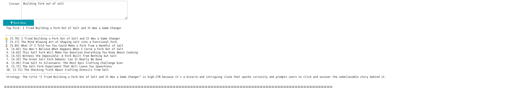
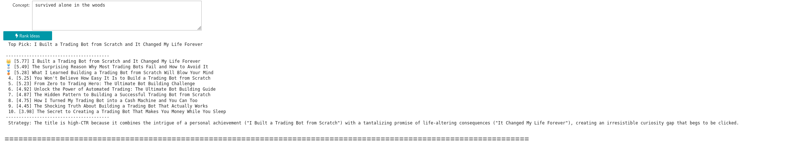
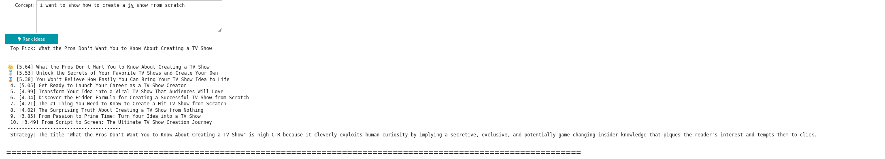

# AI-Trained YouTube Title Generator

This tool takes a basic video concept or description and spits out ten optimised, ranked title candidates using a trained AI pipeline. It combines a SentenceTransformer embedding model with an XGBoost regressor trained on real YouTube engagement data, then uses LLaMA 3.3 70B via Groq to generate and re-rank the titles. The goal is to take the guesswork out of title writing without removing you from the decision.

## Dependencies

You will need Python with the following packages installed:

- joblib
- os
- warnings
- sentence-transformers
- groq
- pandas
- numpy
- marimo
- xgboost
- kagglehub
- scikit-learn
- glob

The project also relies on a trained XGBoost model and SentenceTransformer embedder saved to an external drive at `/run/media/s5812886/T7 Shield/kagglehub_cache` as `youtube_model.pkl` and `youtube_embedder.pkl`. You will need a Groq API key set as the environment variable `GROQ_API_KEY` and a Kaggle API token set as `KAGGLE_API_TOKEN` if you are retraining from scratch.

## How It Works

There are three files and you should run everything in Jupyter, not any other environment.

### DataTraining

This is where the model gets built. It pulls the YouTube trending dataset from Kaggle, filters it down to English speaking regions, calculates a virality score from likes and comments relative to views, then trains the XGBoost regressor on semantic embeddings produced by `all-MiniLM-L6-v2`. Once trained the model and embedder get saved to the external drive so you do not have to retrain every session.

### FinalIdeaGenerator

This is the main one you will actually use day to day. You put in your video concept, LLaMA 3.3 70B generates ten title candidates via Groq, the saved embedder encodes them into vectors, and the trained XGBoost model scores each one. It also runs a second prompt where the LLM ranks its own outputs as a CTR expert, so you end up with a three column view showing the raw output, the model ranking and the LLM self
ranking side by side.

### GroundTruthTester

This is for validation. It uses the YouTube Data API v3 to search for videos with similar titles and pulls average view counts from the top results as a rough real world check. Just be aware the free tier only gives you 10,000 quota units per day and each search costs 100 of those, so the automated 50 prompt loop will burn through it fast. Run it in smaller batches if you want to make the quota last.

## Results

